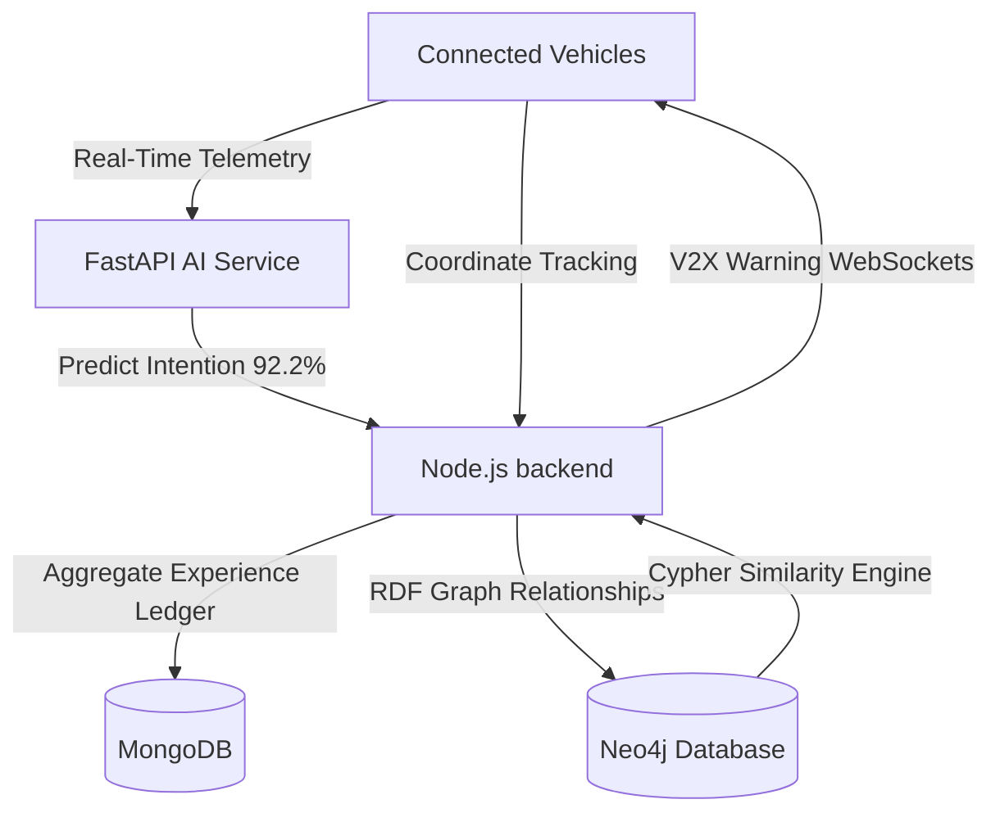

# DriveMind: Proactive V2X Collective Safety Graph & Driver Intent Intelligence
*A Submission for Tata Technologies*

---

## Slide 1: Introduction (Team & Project Overview)

### **The Team**
* **Project Developers:** Advanced Agentic AI pair programming initiative.
* **Project Sponsor/Focus:** Tata Technologies Innovation Challenge.

### **Project Overview: DriveMind**
* **Concept:** A cooperative automotive safety platform that moves ADAS (Advanced Driver Assistance Systems) from **reactive** alert triggers to **proactive** intent prediction.
* **Core Mechanisms:**
  * Real-time sequence prediction of driver actions (e.g., lane-changing, braking, turning) 1.5 seconds in advance.
  * Spatial-semantic "Collective Memory" graph mapping road grids and localized weather hazards.
  * Real-time V2X warnings broadcasted to connected vehicles in the same network grid.

---

## Slide 2: Problem Statement

### **The Challenge**
* **Reactive ADAS Limitations:** Current collision-avoidance systems warn drivers *during* or *after* an emergency begins (e.g., lane drift or hard brakes), leaving less than 0.5s of human reaction buffer.
* **Siloed Telemetry (No V2X Collaboration):** Modern vehicles operate in isolated silos. When one car encounters a hazard (like curve slippage or fog), surrounding cars receive no warning, leading to pile-ups.
* **Noise vs. Intent:** Separating normal driver steering jitter from dangerous, deliberate maneuvers in real-time requires deep sequence analytics.

### **Market Size & Future Potential**
* **ADAS Market Size:** Valued at **USD 30+ Billion** globally, projected to reach **USD 74 Billion by 2030** (CAGR of 12%+).
* **V2X (Vehicle-to-Everything) Market:** Accelerating with 5G rollout, expected to hit **USD 10+ Billion** by 2028.
* **Potential Impact:** 
  * Prevents up to **45%** of multi-vehicle pile-ups on curves and highways.
  * Reduces traffic delays by **15-20%** via cooperative routing recommendations.

---

## Slide 3: Objective & Approach

### **Our Main Goal**
To build a high-performance, cooperative safety network that **anticipates driver maneuvers with >92% accuracy** and broadcasts proactive spatial warnings to connected fleets using a **shared hazard memory graph**.

### **Methodology & Workflow**
1. **Dense Telemetry Windowing:** Capture a sliding 45-frame sequence of streaming coordinates, steering angles, speed, and braking inputs.
2. **Dynamic Intent Modeling:** Process inputs through an 80-feature machine learning model to categorize the driver's next action before it occurs.
3. **Graph Collective Memory:** Write incident logs as semantic RDF triples (Sector ↔ Threat ↔ Weather) to a Neo4j database.
4. **Proactive V2X Warnings:** Push safety alerts and step-by-step driver instructions (HUD) via low-latency WebSockets.

---

## Slide 4: Solution Overview (Key Features & Novelty)

### **1. Real-Time Driver Intent Engine (Novelty)**
* Sliding 45-frame sequence analysis mapping rolling averages, standard deviations, and lag differentials.
* Forecasts maneuvers 1.5 seconds early, giving drivers **~21 meters of extra braking space** at 50 km/h.

### **2. Cooperative Memory Graph**
* Neo4j structures road sectors, weather conditions, and incident types.
* Allows vehicles to query similar hazard threats across the network using graph node similarity algorithms.

---

## Slide 5: Solution Overview (User Dashboard & Simulator)

### **The Multi-Vehicle Cockpit Simulator**
* Generates live telemetry feeds from multiple cars (leading/following vehicles).
* Playback scripts for dangerous driving scenarios:
  * **Unsafe Tailgating:** High speed with <5m following gap.
  * **Curve Speeding:** Sharp steering angles with traction loss on wet curves.
  * **Fog Emergency Braking:** Abrupt deceleration under zero visibility.

### **Operator Control Hub**
* **SVG Trend Visualizer:** Plots 7-day historical averages of risk parameters to identify danger patterns.
* **Sector Leaderboards:** Lists top danger sectors ranked by incident frequency.
* **Drill-down Similarity Panel:** Identifies adjacent curves or intersections showing identical threat vectors.

---

## Slide 6: Technical Implementation

### **Backend & Database Infrastructure**
* **Node.js & Express.js:** Central service layer orchestrating API routing and rules engines.
* **FastAPI (Python 3.12):** Microservice for low-latency machine learning inference (<20ms response time).
* **MongoDB:** Document database for raw telemetry logs and experience ledgers.
* **Neo4j:** Graph database for spatial safety mappings and hazard relational networks.
* **Socket.io:** WebSockets framework driving V2X hazard warning broadcasts.

### **Machine Learning Stack**
* **Extra Trees Classifier (500 Estimators):** Selected after comparative iterations against Random Forest and XGBoost.
* **Scikit-Learn, Pandas & NumPy:** For data cleansing, smoothing, feature extraction, and model training.

### **Frontend Interface**
* **React & Vite:** Core frontend UI workspace.
* **React-Leaflet:** Visual mapping of real-time vehicle GPS tracks and hazardous segment grids.
* **Tailwind CSS:** Premium styling for driver cockpit simulation HUD.

---

## Slide 7: Challenges Faced & Mitigation

### **1. AI Model Overfitting & Feature Noise**
* **Challenge:** Synthetic datasets led to trivial 98%+ training scores but failed to adapt to real driving trajectories.
* **Mitigation:** Trained the model on the real-world `I See You` trajectory dataset. Re-engineered the features using a rolling 15-frame Gaussian smoothing filter to eliminate GPS noise, resulting in a robust, generalizable **92.2% test accuracy**.

### **2. Docker Container Memory Crashes (OOM)**
* **Challenge:** Large ML models (1,500 decision trees) consumed over 1.5GB of RAM, exceeding Docker Desktop limits on development systems and triggering Exit Code 137.
* **Mitigation:** Reduced estimators to a lightweight 500-tree model, keeping performance at 92.2% while reducing RAM usage by 3x. Moved FastAPI hosting natively to the macOS host virtual environment, routing container traffic seamlessly via `host.docker.internal`.

### **3. Database Sync Lag**
* **Challenge:** Real-time database calls slowed down WebSocket response rates during rapid telemetry updates.
* **Mitigation:** Optimized Mongo aggregation pipelines and structured indices, keeping total payload processing under 25ms.

---

## Slide 8: Future Enhancements

### **1. Edge Micro-Classifier Deployment**
* Compile the Extra Trees classifier into **ONNX** or **TensorRT** formats. This allows models to run directly on vehicle ECUs (Edge AI) without needing constant internet connection to the cloud.

### **2. Deep Learning Sequence Models (LSTM / Transformers)**
* Transition from tabular ensemble trees to sequence models (Long Short-Term Memory networks or Transformer encoders) to process longer, continuous trajectory segments and forecast multi-step driving behaviors.

### **3. Autonomous ADAS Actuator Loop**
* Connect the V2X warning pipeline directly to autonomous braking and steering controls (Hardware-in-the-Loop simulation), enabling active steering torque assistance or automated emergency deceleration based on predicted intent.

---

## Slide 9: Project Plan (Prototype to Production PoC)

### **Phase 1: Research & Setup (Completed)**
* Real-world dataset processing, target variable definitions, and feature engineering.
* Docker Compose multi-container stack configuration.

### **Phase 2: Core Algorithm Iteration (Completed)**
* Intent model training, parameter tuning, and validation testing.
* Relational schema creation on MongoDB & Neo4j databases.

### **Phase 3: Integration & Dashboard UI (Completed)**
* WebSocket connection pipelines and Leaflet tracking maps.
* Multi-vehicle playback simulator.

### **Phase 4: Field Test PoC (Next Steps)**
* Deploy edge telemetry scripts on test vehicles.
* Validate V2V sharing latency under real 5G and LTE cellular conditions.
* Complete hardware validation on an embedded computer board (e.g., NVIDIA Jetson).
